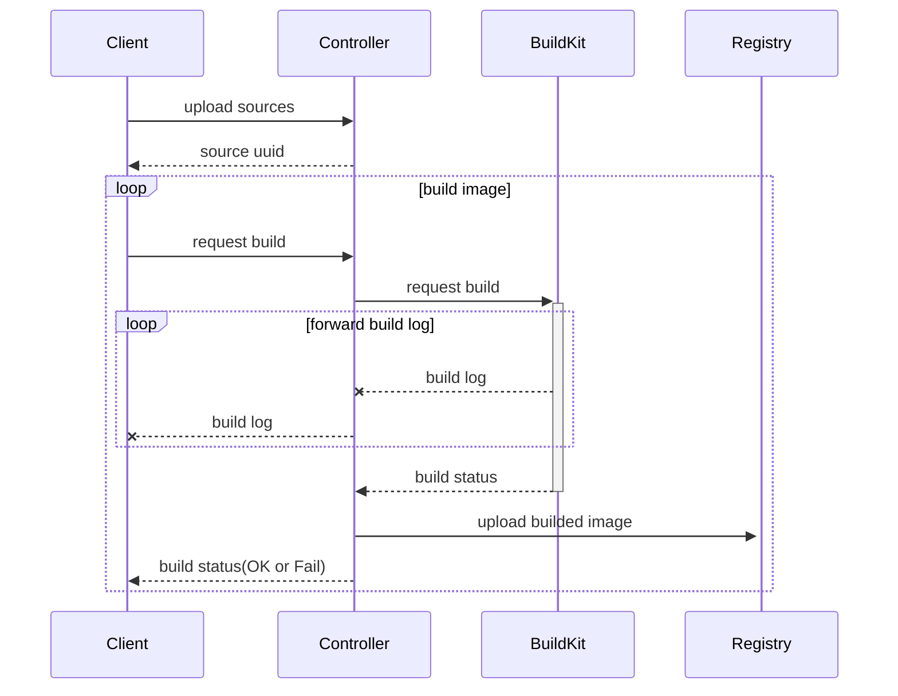
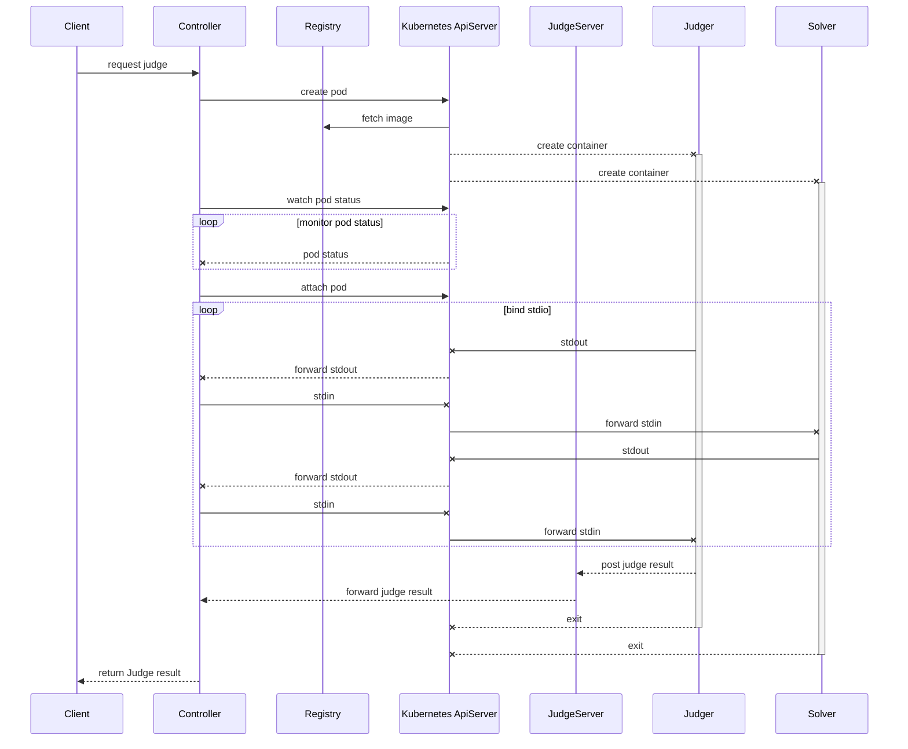

# 组件与生命周期

## 项目目录结构

```bash
.
├── doc
├── examples # 测试用例，自测用
│   └── A+B Problem
│       ├── judger # 判题器 (Judger)
│       │   ├── proto
│       │   └── src
│       ├── solver-bash # 解题者(Solver)
│       └── solver-...
├── manifests # k8s 部署资源文件， 对这这里 kubectl apply
├── proto # protobuf协议文件， 后续考虑挪出
├── src
│   ├── bin
│   │   ├── client # 调试用客户端，使用这个连接集群内的控制器
│   │   │   ├── console
│   │   │   └── exe
│   │   └── server # 判题控制器，实际部署进集群
│   │       ├── console
│   │       └── controller
│   │           └── judge
│   └── id # 公用包，用于生成 ID
└── tools
```

## 生命周期

本项目主要包含 Contrller 和一个对应的调试用 Client。要使本项目跑起来需要参考 [README 里面的 Dependency](../README.md#dependencies)

完整的判题流程含:

* 上传（tar包）
* 构建（解题镜像）
* 和判题器构建 Pod
* 监听 & 转发 输入/输出，给出反馈

四个步骤。

### 上传和构建



由 Client 打包成 tar，之后由 grpc binary 传输，由于在一个请求内完成，故要求 ingress 有能力做大小限制。

> 此处上传与构建很重，且均在同一个实例内临时文件夹完成，需要进行持久化操作，使得其能被分发给多个实例完成。

其中上传和构建在 Client 内被合并为一个操作 （Upbuild）， 具体参见[客户端源码](src/bin/client/exe/upbuild.rs)

> 实际上对于判题的人，上传和构建是一个操作，但对于解题者，上传构建判题才是一套流程，故上层可作为一个中间层组合这些原子能力。
> 但总而言之，上传和构建可以合并为同一个步骤。

### 判题与反馈



Client 发出一个判题请求，其中含有两个ID （Solver & Judger），Controller 会将两个镜像安排进同一个 Pod 中，并监听判题器的请求，使其通过注入环境变量的 Token 能正确验明身份并返回判题结果。

## 附录

### 注入进判题器的环境变量表

见[源文件](../src/bin/server/controller/judge/manifest.rs), 或者参照[样例](../examples/A%2BB%20Problem/../A+B%20Problem/judger/src/main.rs)

> 其实这里可以优化掉 `JudgeID`，改成只需要回传一个`JUDGE_TOKEN`

| 名称          | 备注                    |
| ------------- | ----------------------- |
| `JUDGE_ID`    | 本次判题 ID             |
| `APIKEY`      | 提交结果时需要的 APIKEY |
| `JUDGER_ADDR` | 将结果提交到该地址      |
